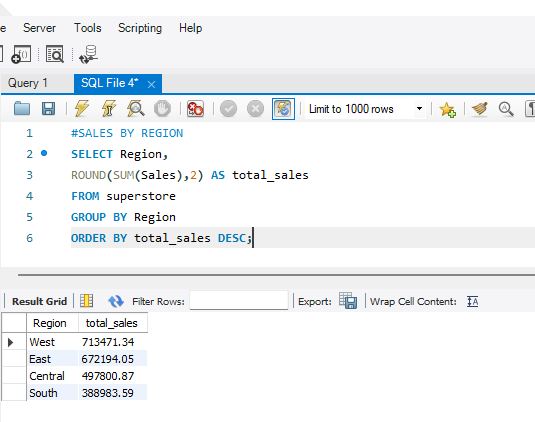
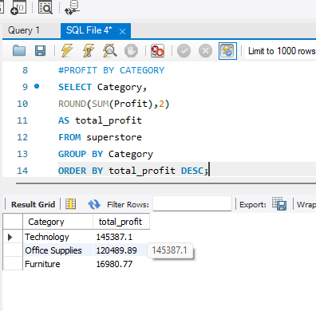
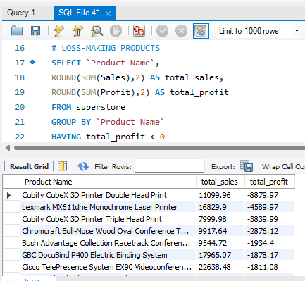
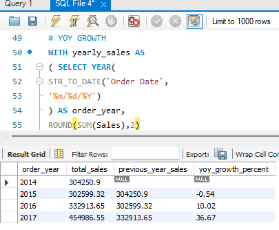

# 📊 Superstore Sales & Profitability Analysis (SQL Project)

SQL-based retail sales analysis project using the Superstore dataset to analyze revenue, profit, customer behavior, product performance, and business growth trends.

## Key Business Insights
✅ Highest sales region identified  
✅ Most profitable category identified  
✅ Loss-making products detected  
✅ Customer purchase analysis  
✅ Shipping performance analysis  
✅ Year-over-Year (YoY) sales growth analysis  
✅ Running total & ranking using window functions# Superstore Sales & Profitability Analysis (SQL Project)

## Project Overview

This project analyzes retail sales performance using SQL on the Superstore dataset.

The objective was to identify:

- Regional sales performance
- Category profitability
- Customer purchasing behavior
- Top-performing products
- Loss-making products
- Monthly and yearly sales trends
- Year-over-Year (YoY) growth
- Shipping performance

---

## Dataset Information

Dataset: Superstore Dataset

Total records analyzed: 9,600+

Source:
https://www.kaggle.com/datasets/vivek468/superstore-dataset-final

---

## SQL Concepts Used

### Basic SQL
- SELECT
- WHERE
- GROUP BY
- HAVING
- ORDER BY
- LIMIT

### Aggregate Functions
- SUM()
- AVG()
- COUNT()
- ROUND()

### Date Functions
- STR_TO_DATE()
- YEAR()
- MONTH()
- DATEDIFF()

### Window Functions
- ROW_NUMBER()
- DENSE_RANK()
- LAG()
- SUM() OVER()

### Advanced SQL
- CTE (Common Table Expression)
- Running Total
- YoY Growth Analysis
- Ranking Functions

---

## Business Questions Solved

1. Which region generated highest sales and profit?

2. Which category is most profitable?

3. Which products generate maximum revenue?

4. Which products are causing losses?

5. Who are the highest-value customers?

6. Which months contribute most to sales?

7. How has business grown year-over-year?

8. How do discounts affect profitability?

9. What is the average shipping delay?

---

## Key Findings

- West region generated highest sales and profit.
- Technology category showed strongest profitability.
- Tables and Bookcases generated losses despite high sales.
- November and December recorded peak sales.
- Average shipping duration was around 4 days.
- Business achieved strong YoY growth in 2017.

---

## Tools Used

- MySQL Workbench
- SQL
- VS Code
- Kaggle Dataset

---

## Project Structure

Superstore_SQL_Project/

README.md

superstore_queries.sql

project_findings.txt

dataset_link.txt

## Project Screenshots

### Sales by Region

### Profit by Category

### Loss-Making Products

### Year-over-Year Growth

